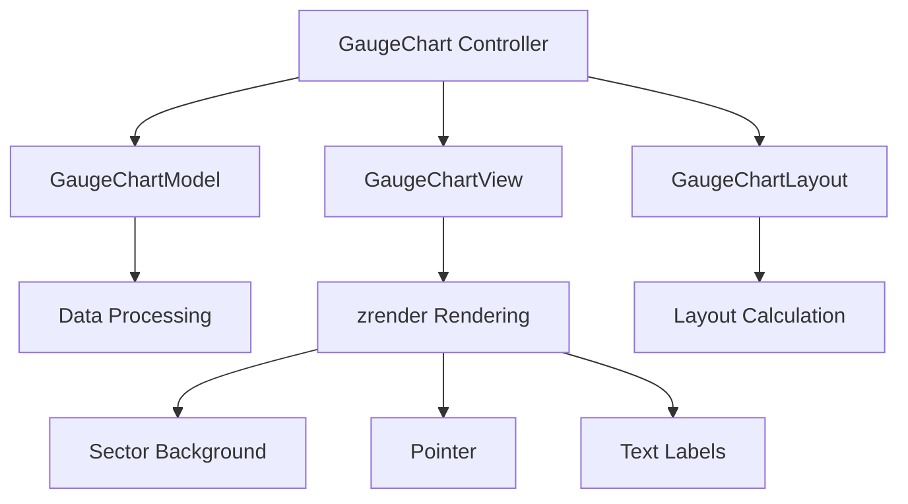

# 仪表盘组件技术方案设计

## 1. 项目架构设计

### 1.1 总体架构
```
GaugeChart (Controller)
├── GaugeChartModel (Model) - 数据管理
├── GaugeChartView (View) - 视图渲染  
├── GaugeChartLayout (Layout) - 布局计算
└── Utils - 工具函数
    ├── angle.ts - 角度计算
    ├── color.ts - 颜色处理
    ├── animation.ts - 动画处理
    └── math.ts - 数学计算
```

### 1.2 组件关系图


## 2. 核心配置设计

### 2.1 配置接口
```typescript
interface GaugeConfig {
    width: number;
    height: number;
    range: { min: number; max: number };
    colorSegments: ColorSegment[];
    pointer: PointerConfig;
    text: TextConfig;
    labels: LabelsConfig;
    animation: AnimationConfig;
}

interface ColorSegment {
    min: number;
    max: number;
    color: string;
    label?: string;
}
```

## 3. 渲染机制

### 3.1 渲染元素结构
- BackgroundSector - 半圆背景
- ColorSegments[] - 颜色分段扇形
- Pointer - 指针
- CenterCircle - 中心圆
- ValueText - 数值文本
- LabelText - 标签文本
- EndLabels - 端点标签

### 3.2 角度计算算法
```typescript
function valueToAngle(value: number, min: number, max: number): number {
    const ratio = (value - min) / (max - min);
    return -90 + ratio * 180; // 半圆形 -90° 到 90°
}
```

## 4. 默认配置

```typescript
export const DEFAULT_GAUGE_CONFIG: GaugeConfig = {
    width: 400,
    height: 300,
    range: { min: 0, max: 100 },
    colorSegments: [
        { min: 0, max: 25, color: '#ff4444' },
        { min: 25, max: 50, color: '#ff8844' },
        { min: 50, max: 75, color: '#ffcc44' },
        { min: 75, max: 100, color: '#44ff44' }
    ],
    pointer: {
        length: 0.8,
        width: 3,
        color: '#333'
    },
    text: {
        value: { fontSize: 48, color: '#333' },
        label: { fontSize: 16, color: '#666' }
    },
    labels: {
        startLabel: 'Extreme Fear',
        endLabel: 'Extreme Greed',
        fontSize: 14,
        color: '#999'
    },
    animation: {
        duration: 1000,
        easing: 'cubicOut'
    }
};
```

## 5. 布局计算机制

### 5.1 布局计算流程
```typescript
interface LayoutResult {
    center: { x: number; y: number };
    radius: number;
    bounds: {
        width: number;
        height: number;
    };
    elements: {
        gauge: GaugeLayout;
        pointer: PointerLayout;
        text: TextLayout;
        labels: LabelsLayout;
        ticks: TicksLayout;
    };
}

class GaugeChartLayout {
    calculate(config: GaugeConfig): LayoutResult {
        // 1. 计算可用空间
        const availableWidth = config.width - config.padding.left - config.padding.right;
        const availableHeight = config.height - config.padding.top - config.padding.bottom;
        
        // 2. 计算半径
        const radius = this.calculateRadius(availableWidth, availableHeight, config);
        
        // 3. 计算中心点
        const center = this.calculateCenter(config, radius);
        
        // 4. 计算各元素布局
        return {
            center,
            radius,
            bounds: { width: availableWidth, height: availableHeight },
            elements: {
                gauge: this.calculateGaugeLayout(center, radius, config),
                pointer: this.calculatePointerLayout(center, radius, config),
                text: this.calculateTextLayout(center, config),
                labels: this.calculateLabelsLayout(center, radius, config),
                ticks: this.calculateTicksLayout(center, radius, config)
            }
        };
    }
}
```

## 6. 状态管理机制

### 6.1 组件状态
```typescript
interface GaugeState {
    // 数据状态
    currentValue: number;
    targetValue: number;
    
    // 渲染状态
    isRendered: boolean;
    isAnimating: boolean;
    
    // 配置状态
    config: GaugeConfig;
    
    // 布局状态
    layout: LayoutResult;
}
```

### 6.2 状态更新机制
```typescript
class GaugeChartModel {
    private state: GaugeState;
    
    // 更新数值
    updateValue(newValue: number, animated: boolean = true): void {
        this.state.targetValue = newValue;
        
        if (animated) {
            this.animateToValue(newValue);
        } else {
            this.state.currentValue = newValue;
            this.triggerRerender();
        }
    }
    
    // 更新配置
    updateConfig(newConfig: Partial<GaugeConfig>): void {
        this.state.config = { ...this.state.config, ...newConfig };
        this.triggerRelayout();
    }
}
```

## 7. 事件机制

### 7.1 事件类型定义
```typescript
interface GaugeEvents {
    'rendered': () => void;
    'valueChanged': (value: number) => void;
    'animationStart': () => void;
    'animationEnd': () => void;
    'configChanged': (config: GaugeConfig) => void;
}
```

## 8. 扩展机制

### 8.1 插件接口
```typescript
interface GaugePlugin {
    name: string;
    beforeRender?(context: RenderContext): void;
    afterRender?(context: RenderContext): void;
    onValueChange?(oldValue: number, newValue: number): void;
}
```

## 9. 性能优化策略

### 9.1 渲染优化
- **按需渲染**: 只在数值或配置变化时重绘
- **图层分离**: 静态元素和动态元素分层
- **动画优化**: 使用zrender的内置动画系统

### 9.2 内存优化
- **对象池**: 复用图形对象
- **事件清理**: 完善的销毁机制
- **防抖处理**: 频繁更新时的防抖

## 10. API 设计

### 10.1 主要API
```typescript
class GaugeChart extends Controller {
    constructor(container: HTMLElement, config?: Partial<GaugeConfig>);
    
    // 数据操作
    setData(data: GaugeData): void;
    updateValue(value: number, animated?: boolean): void;
    getValue(): number;
    
    // 配置操作
    setConfig(config: Partial<GaugeConfig>): void;
    getConfig(): GaugeConfig;
    
    // 渲染控制
    render(): void;
    resize(width?: number, height?: number): void;
    destroy(): void;
    
    // 事件管理
    on<K extends keyof GaugeEvents>(event: K, handler: GaugeEvents[K]): void;
    off<K extends keyof GaugeEvents>(event: K, handler: GaugeEvents[K]): void;
}
```

这个技术方案设计确保了：
1. **高可配置性**: 支持颜色分段、标签、数值范围等全面配置
2. **性能优化**: 按需渲染和动画优化
3. **扩展性**: 清晰的模块划分和插件机制
4. **类型安全**: 完整的TypeScript类型定义
5. **易用性**: 简洁的API设计

准备开始代码实现？ 